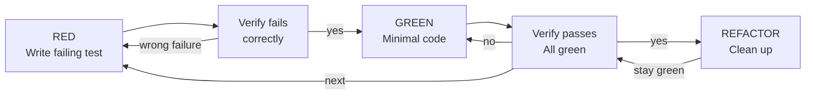

# Test-First Discipline

This reference supplements `work`'s test-first execution guardrails with behavioral patterns absorbed from obra/superpowers' test-driven-development skill. Load it when implementing units marked `Execution note: test-first` or when the user explicitly requests TDD.

## The Iron Law

```
NO PRODUCTION CODE WITHOUT A FAILING TEST FIRST
```

Write code before the test? Delete it. Start over.

**No exceptions:**
- Don't keep it as "reference"
- Don't "adapt" it while writing tests
- Don't look at it
- Delete means delete

Implement fresh from tests. Period.

## RED-GREEN-REFACTOR Cycle



### RED — Write Failing Test

Write one minimal test showing what should happen. Each test:

- Names one specific behavior
- Uses real code (mocks only if unavoidable)
- Is clear enough that the failure message explains the gap

```typescript
// ✅ Good: Clear name, tests real behavior, one thing
test('retries failed operations 3 times', async () => {
  let attempts = 0;
  const operation = () => { attempts++; if (attempts < 3) throw new Error('fail'); return 'success'; };
  const result = await retryOperation(operation);
  expect(result).toBe('success');
  expect(attempts).toBe(3);
});
```

### Verify RED — Watch It Fail

**MANDATORY. Never skip.**

Confirm:
- Test fails (not errors)
- Failure message is expected
- Fails because feature missing (not typos)

Test passes? You're testing existing behavior. Fix test.
Test errors? Fix error, re-run until it fails correctly.

### GREEN — Minimal Code

Write simplest code to pass the test. Don't add features, refactor other code, or "improve" beyond the test.

### Verify GREEN — Watch It Pass

**MANDATORY.**

Confirm:
- Test passes
- Other tests still pass
- Output pristine (no errors, warnings)

### REFACTOR — Clean Up

After green only: remove duplication, improve names, extract helpers. Keep tests green. Don't add behavior.

## Anti-Rationalization Table

| Excuse | Reality |
|--------|---------|
| "Too simple to test" | Simple code breaks. Test takes 30 seconds. |
| "I'll test after" | Tests passing immediately prove nothing. |
| "Tests after achieve same goals" | Tests-after = "what does this do?" Tests-first = "what should this do?" |
| "Already manually tested" | Ad-hoc ≠ systematic. No record, can't re-run. |
| "Deleting X hours is wasteful" | Sunk cost fallacy. Keeping unverified code is technical debt. |
| "Keep as reference, write tests first" | You'll adapt it. That's testing after. Delete means delete. |
| "Need to explore first" | Fine. Throw away exploration, start with TDD. |
| "Test hard = design unclear" | Listen to test. Hard to test = hard to use. |
| "TDD will slow me down" | TDD faster than debugging. Pragmatic = test-first. |
| "Manual test faster" | Manual doesn't prove edge cases. You'll re-test every change. |
| "Existing code has no tests" | You're improving it. Add tests for existing code. |

## Red Flags — STOP and Start Over

- Code before test
- Test after implementation
- Test passes immediately (didn't see it fail)
- Can't explain why test failed
- Tests added "later"
- Rationalizing "just this once"
- "I already manually tested it"
- "Tests after achieve the same purpose"
- "It's about spirit not ritual"
- "Keep as reference" or "adapt existing code"
- "Already spent X hours, deleting is wasteful"
- "TDD is dogmatic, I'm being pragmatic"
- "This is different because..."

**All of these mean: Delete code. Start over with TDD.**

## When to Apply

Apply test-first discipline when:
- The plan unit carries `Execution note: test-first`
- The user explicitly asks for TDD
- Implementing a bug fix (write failing test reproducing the bug first)

Skip for:
- Trivial renames
- Pure configuration changes
- Pure styling work
- Scaffolding with no behavior

## Why Order Matters

Tests written after code pass immediately — passing immediately proves nothing:
- Might test wrong thing
- Might test implementation, not behavior
- Might miss edge cases you forgot
- You never saw it catch the bug

Test-first forces you to see the test fail, proving it actually tests something.

## Verification Checklist

Before marking test-first work complete:

- [ ] Every new function/method has a test
- [ ] Watched each test fail before implementing
- [ ] Each test failed for expected reason (feature missing, not typo)
- [ ] Wrote minimal code to pass each test
- [ ] All tests pass
- [ ] Tests use real code (mocks only if unavoidable)
- [ ] Edge cases and errors covered

Can't check all boxes? You skipped TDD. Start over.
